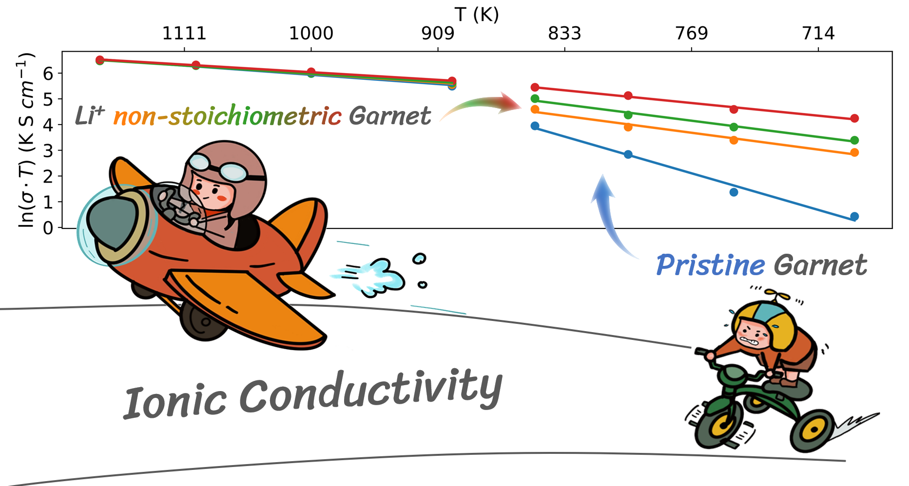
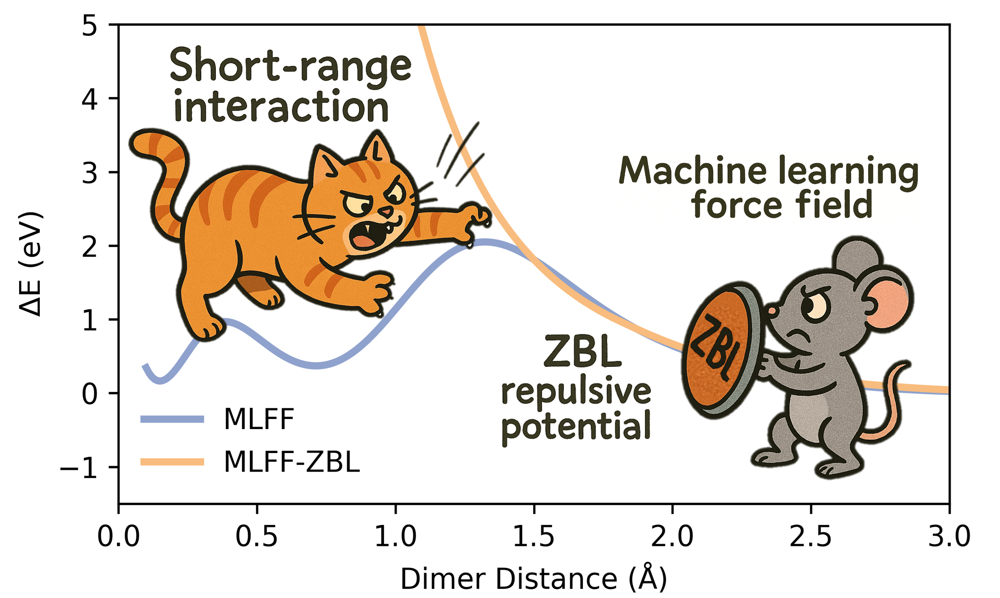

  <h1>🗂️ Research Datasets</h1>
  
Source Files and Scripts of my published research papers

      

Welcome to my **Research Datasets**. This repository include the datasets and associated materials from my published research papers. The datasets provided here are made available for the purpose of reproducibility and to support further research in the field.

### Available Research Papers:

#### Paper 1

    

**Title**: Impact of Lithium Nonstoichiometry on Ionic Diffusion in Tetragonal Garnet-Type Li7La3Zr2O12

**Link**: [https://doi.org/10.1021/acs.chemmater.4c02454](https://doi.org/10.1021/acs.chemmater.4c02454)

**Cite this**: *Chem. Mater.* 2024, 36, 23, 11551–11557

**Dataset**: [Oxygen_Vacancy](./Oxygen_Vacancy/)

---

#### Paper 2

    

**Title**: Improving robustness and training efficiency of machine-learned potentials by incorporating short-range empirical potentials

**Link**: [https://doi.org/10.48550/arXiv.2504.15925](https://doi.org/10.48550/arXiv.2504.15925)

**Cite this**: arXiv:2504.15925

**Dataset**: [NEP-ZBL](./NEP-ZBL/)

---

Each folder contains the relevant raw data files, scripts, and any supplementary information needed to reproduce the results from each paper.

## Citation

If you use any of the data from this repository in your own research, please cite the appropriate paper(s).

## Contact

If you have any questions, issues, or feedback regarding this repository or the data, please feel free to contact me ([yanzihan@westlake.edu.cn](mailto:yanzihan@westlake.edu.cn)).
